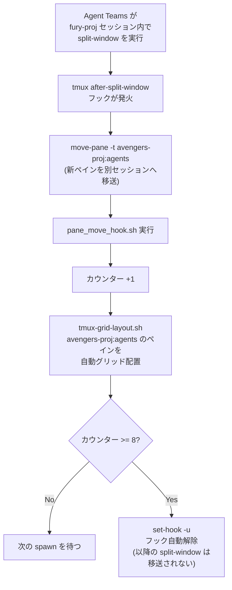

# tmux アーキテクチャ — Agent Teams における tmux 制御

> **対象**: agent-team-avengers（Agent Teams 版）
> **最終更新**: 2026-03-31

## 概要

このシステムでは、Claude Code の **Agent Teams**（`teammateMode: tmux`）を利用してマルチエージェントを構成する。
ペインの生成はスクリプトではなく Agent Teams が自動的に行い、`assemble.sh` はその自動生成されたペインを別セッションへ移送するフック機構を提供する。

## セッション構成

起動完了後、tmux 上には以下の2セッションが存在する。

| セッション名 | window | 内容 |
|-------------|--------|------|
| `fury-<project>` | `fury` | Fury（Claude Code, team_leader）のみ |
| `avengers-<project>` | `agents` | JARVIS, Bruce, Strange, Tony, Peter, Cap, Marvel, Shuri（8ペイン、グリッド配置） |

```
┌─────────────────────────────────────┐
│ fury-<project> セッション           │
│ ┌─────────────────────────────────┐ │
│ │ window: fury                    │ │
│ │ [pane 0: Fury (Claude Code)]    │ │
│ └─────────────────────────────────┘ │
└─────────────────────────────────────┘

┌─────────────────────────────────────┐
│ avengers-<project> セッション       │
│ ┌─────────────────────────────────┐ │
│ │ window: agents (grid layout)    │ │
│ │ ┌────────┬────────┐            │ │
│ │ │JARVIS  │ Bruce  │            │ │
│ │ ├────────┼────────┤            │ │
│ │ │Strange │ Tony   │            │ │
│ │ ├────────┼────────┤            │ │
│ │ │Peter   │ Cap    │            │ │
│ │ ├────────┼────────┤            │ │
│ │ │Marvel  │ Shuri  │            │ │
│ │ └────────┴────────┘            │ │
│ └─────────────────────────────────┘ │
└─────────────────────────────────────┘
```

## 起動フロー

```mermaid
sequenceDiagram
    participant User as Hayato
    participant Script as assemble.sh
    participant TmuxFury as "tmux: fury-proj"
    participant TmuxAvengers as "tmux: avengers-proj"
    participant Fury as "Fury (Claude Code)"
    participant AgentTeams as Agent Teams Engine

    User->>Script: ./assemble.sh 実行

    rect rgb(40, 40, 60)
        Note over Script: STEP 7: tmux セッション構築
        Script->>TmuxFury: new-session -s fury-proj -n fury<br/>(claude-avengers を起動)
        Script->>TmuxAvengers: new-session -s avengers-proj -n agents<br/>(空のプレースホルダ)
        Script->>TmuxFury: set-hook after-split-window<br/>"move-pane → avengers-proj:agents"
    end

    rect rgb(40, 60, 40)
        Note over Script: STEP 8: 初期指示を Fury に送信
        Script->>TmuxFury: send-keys "TeamCreate + 8名 spawn 指示"
    end

    Note over Fury: Fury が Claude Code として起動完了

    Fury->>AgentTeams: TeamCreate(avengers-team-proj)

    loop 8回 (jarvis, bruce, strange, tony, peter, cap, marvel, shuri)
        Fury->>AgentTeams: Task(spawn teammate)
        AgentTeams->>TmuxFury: tmux split-window<br/>(fury セッション内に新ペイン生成)

        rect rgb(60, 40, 40)
            Note over TmuxFury: after-split-window フック発火!
            TmuxFury->>TmuxAvengers: move-pane -t avengers-proj:agents<br/>(新ペインを avengers へ移送)
            TmuxFury->>TmuxFury: run-shell pane_move_hook.sh
            Note over TmuxFury: カウンター++<br/>grid-layout 適用<br/>初期プレースホルダ pane 削除<br/>(8回目でフック自動解除)
        end
    end

    Note over TmuxFury: Fury のみ残る(1ペイン)
    Note over TmuxAvengers: 8エージェントがグリッド配置
```



## ペイン移送フックの詳細

Agent Teams が Fury のセッション内で `split-window` するたびに tmux フックが発火し、新ペインを avengers セッションへ移送する。これがこのシステムの中核メカニズムである。

### フックの処理フロー



### フック解除の意味

8人全員が avengers セッションに移動した後、フックは自動解除される。
これにより、Fury がサブエージェント（Task tool）を使った際の `split-window` は移送されず、Fury のペイン内に留まる。
Agent Teams のチームメイトとサブエージェントを区別する仕組みである。

### 関連ファイル

| ファイル | 役割 |
|---------|------|
| `assemble.sh` (STEP 7) | セッション作成、フック設定 |
| `scripts/claude-avengers` | Claude Code ラッパー。`AVENGERS_ROLE=fury` を設定 |
| `scripts/tmux-grid-layout.sh` | ペイン数に応じた動的グリッドレイアウト適用 |
| `.avengers/status/pane_move_hook.sh` | 実行時生成。カウンター管理・レイアウト適用・フック解除 |
| `.avengers/status/.pane_move_count` | 実行時生成。移送済みペインのカウンター |
| `scripts/check-team-spawn.sh` | PreToolUse フック。Fury 以外の spawn をブロック |

## 環境変数と命名規則

`scripts/project-env.sh` で定義される共通変数:

| 変数名 | 値 | 用途 |
|--------|------|------|
| `TMUX_FURY` | `fury-<project>` | Fury セッション名 |
| `TMUX_AVENGERS` | `avengers-<project>` | チームメイトセッション名 |
| `TEAM_NAME` | `avengers-team-<project>` | Agent Teams チーム名 |
| `PROJECT_NAME_SAFE` | basename を sanitize | セッション名・チーム名の接尾辞 |

## 操作方法

```bash
# Fury にアタッチ（指示を出す）
.avengers/bin/fury.sh
# または: tmux attach -t fury-<project>

# チームメイトにアタッチ（観察する）
.avengers/bin/avengers.sh
# または: tmux attach -t avengers-<project>

# セッション一覧
tmux ls

# ペイン切替（セッション内）
Ctrl+b → 矢印キー

# デタッチ
Ctrl+b → d
```

## 監視（watchdog.sh）

`watchdog.sh` は両セッションの各ペインを定期的にスキャンし、以下を検知する:

| 検知対象 | ターゲット | アクション |
|---------|-----------|-----------|
| API Limit 到達 | 全ペイン | リセット時刻を記録、時刻到達後に再開指示 |
| JARVIS アイドル | `avengers:0.0` | 未処理報告があれば起床 |
| dashboard.md 更新 | ファイル監視 | Fury に通知 |
| 長時間 thinking | 全ペイン | ログ出力（自動介入なし） |

## ~/multi-agent-avengers との本質的な違い

| 観点 | multi-agent-avengers | agent-team-avengers (本リポジトリ) |
|------|---------------------|---------------------|
| ペイン生成 | `assemble.sh` が `split-window` / `new-window` で全ペイン作成 | Agent Teams が `split-window` で自動生成 |
| セッション構成 | 1セッション + 4 window (hq/reviewers/developers/testers) | 2セッション (fury / avengers) |
| ペインの中身 | シェルプロンプト（Claude は後から起動） | Claude Code プロセスそのもの |
| レイアウト制御 | `split-window -h/-v` で明示的に配置 | `after-split-window` フック + 動的グリッド |
| エージェント間通信 | ファイルベースキュー (`queue/reports/*.yaml`) | Agent Teams API (`SendMessage`, `TaskCreate`) |
| ペインの順序 | 決定的（スクリプトで固定） | Agent Teams の spawn 順序に依存 |

この違いにより、ペインをどの window に属させるかをスクリプト側で細かく制御するのが難しい。
「自動 spawn → フックで横取り」というアーキテクチャが、レイアウト設計の制約となっている。
